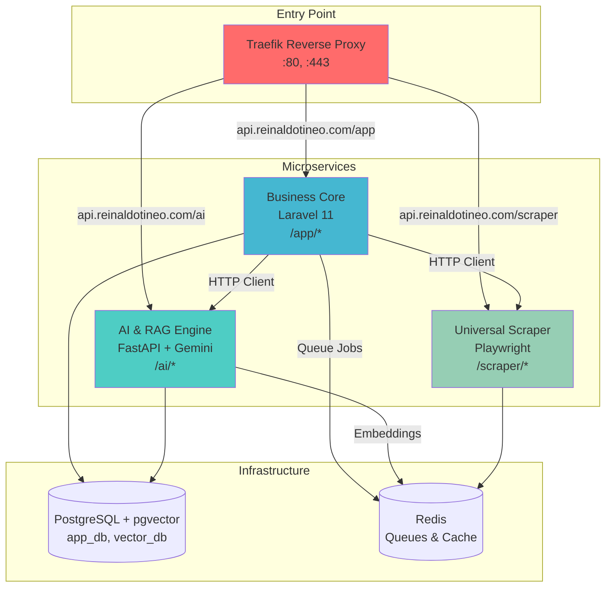
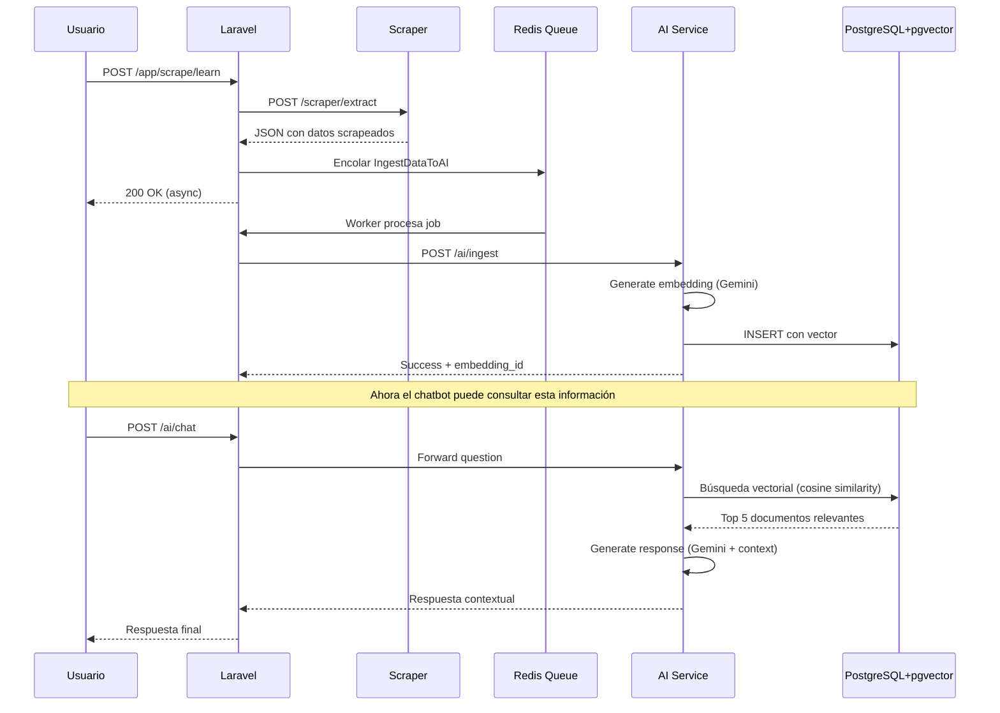

# Sistema SaaS con RAG y Scraping

Sistema de microservicios profesional con capacidades de IA, memoria vectorial y scraping web.

## 🏗️ Arquitectura



## 📋 Servicios

### 🤖 AI & RAG Engine (`/ai/*`)
Motor de inteligencia artificial con memoria vectorial usando Gemini API.

**Funcionalidades:**
- `POST /ai/ingest`: Recibe texto, genera embeddings y los almacena en pgvector
- `POST /ai/chat`: Búsqueda semántica + generación de respuestas contextual
- Embeddings de 768 dimensiones con `models/embedding-001`
- Generación de texto con `gemini-1.5-flash`

### 🏢 Business Core (`/app/*`)
Orquestador principal del sistema en Laravel 11.

**Funcionalidades:**
- Autenticación de usuarios (Sanctum)
- Gestión de pagos y suscripciones
- Cliente HTTP para comunicarse con microservicios
- Sistema de colas con Redis
- Endpoints de orchestración

### 🕷️ Universal Scraper (`/scraper/*`)
Extractor de datos con renderizado JavaScript.

**Funcionalidades:**
- `POST /scraper/extract`: Scraping genérico con reglas personalizadas
- `POST /scraper/scrape/job-posting`: Scraping especializado de ofertas
- Soporte Playwright para JavaScript
- BeautifulSoup para parsing HTML

## 🚀 Inicio Rápido

### Prerrequisitos
- Docker y Docker Compose
- Gemini API Key ([Obtener aquí](https://aistudio.google.com/app/apikey))

### Instalación

1. **Clonar y configurar variables de entorno**
```bash
cd microservices
cp .env.example .env
```

2. **Editar `.env` con tus credenciales**
```env
GEMINI_API_KEY=tu_api_key_aqui
DB_PASSWORD=tu_password_seguro
```

3. **Inicializar Laravel**
```bash
# Si no tienes un proyecto Laravel existente, créalo:
cd business-core
composer create-project laravel/laravel . "11.*"
cd ..
```

4. **Levantar todos los servicios**
```bash
docker-compose up -d
```

5. **Verificar que todo está funcionando**
```bash
# Health checks
curl http://localhost/ai/health
curl http://localhost/app/health
curl http://localhost/scraper/health
```

## 📚 Ejemplos de Uso

### Ejemplo 1: Ingestar un CV

```bash
curl -X POST http://localhost/ai/ingest \
  -H "Content-Type: application/json" \
  -d '{
    "content": "Juan Pérez - Desarrollador Full Stack con 5 años de experiencia en Laravel, Python y React. Experto en microservicios y arquitecturas cloud.",
    "metadata": {"type": "cv", "candidate": "Juan Pérez"},
    "source": "upload"
  }'
```

### Ejemplo 2: Consultar con RAG

```bash
curl -X POST http://localhost/ai/chat \
  -H "Content-Type: application/json" \
  -d '{
    "question": "¿Qué candidatos tienen experiencia en Laravel?",
    "max_context_items": 5
  }'
```

### Ejemplo 3: Scrapear y Aprender (Flujo Completo)

```bash
# Laravel orquesta: Scraper → Queue → AI
curl -X POST http://localhost/app/scrape/learn \ 
  -H "Content-Type: application/json" \
  -d '{
    "url": "https://example.com/job-posting",
    "source": "job_board"
  }'
```

**Flujo interno:**
1. Laravel llama al Scraper Service
2. Scraper extrae los datos de la oferta
3. Laravel encola un Job (`IngestDataToAI`)
4. El Worker procesa el job y envía datos al AI Service
5. AI Service crea embeddings y los almacena

## 🗂️ Estructura del Proyecto

```
microservices/
├── docker-compose.yml           # Orchestración de servicios
├── .env.example                 # Variables de entorno
├── scripts/
│   └── create-databases.sh      # Inicialización de BD
│
├── ai-service/                  # 🤖 AI & RAG Engine
│   ├── app/
│   │   ├── main.py             # FastAPI app
│   │   ├── database.py         # Conexión pgvector
│   │   └── rag/
│   │       ├── embeddings.py   # Gemini embeddings
│   │       └── chat.py         # Motor RAG
│   ├── requirements.txt
│   └── Dockerfile
│
├── business-core/               # 🏢 Laravel 11
│   ├── app/
│   │   ├── Services/
│   │   │   ├── AIServiceClient.php
│   │   │   └── ScraperServiceClient.php
│   │   ├── Jobs/
│   │   │   └── IngestDataToAI.php
│   │   └── Http/Controllers/Api/
│   │       ├── HealthController.php
│   │       └── ScrapeController.php
│   ├── routes/api.php
│   ├── config/services.php
│   ├── docker/
│   │   ├── nginx.conf
│   │   └── supervisord.conf
│   └── Dockerfile
│
└── scraper-service/             # 🕷️ Scraper
    ├── app/
    │   ├── main.py
    │   └── scrapers/
    │       └── base.py          # UniversalScraper
    ├── requirements.txt
    └── Dockerfile
```

## 🔧 Configuración Avanzada

### Variables de Entorno Críticas

**AI Service:**
- `GEMINI_API_KEY`: API key de Google Gemini **(OBLIGATORIO)**
- `POSTGRES_DB`: Nombre de la base vectorial (default: `vector_db`)

**Business Core (Laravel):**
- `APP_KEY`: Generar con `php artisan key:generate`
- `AI_SERVICE_URL`: URL interna del AI service
- `SCRAPER_SERVICE_URL`: URL interna del scraper

### Acceso a Servicios

- **Traefik Dashboard**: http://localhost:8080
- **AI Service**: http://localhost/ai
- **Business Core**: http://localhost/app
- **Scraper Service**: http://localhost/scraper
- **PostgreSQL**: localhost:5432
- **Redis**: localhost:6379

## 🧪 Testing

```bash
# Verificar PostgreSQL con pgvector
docker-compose exec postgres psql -U postgres -d vector_db -c "SELECT * FROM pg_extension WHERE extname = 'vector';"

# Ver logs de un servicio
docker-compose logs -f ai-service

# Ejecutar queue worker manualmente
docker-compose exec business-core php artisan queue:work --verbose
```

## 📊 Flujo de Datos Completo



## 🛠️ Troubleshooting

### Error: "AI Service unavailable"
```bash
# Verificar logs
docker-compose logs ai-service

# Verificar API key
docker-compose exec ai-service env | grep GEMINI
```

### Error: "pgvector extension not found"
```bash
# Reconstruir base de datos
docker-compose down -v
docker-compose up -d postgres
```

### Queue jobs no se procesan
```bash
# Verificar que el worker está corriendo
docker-compose ps queue-worker

# Ver logs del worker
docker-compose logs -f queue-worker
```

## 📝 Notas Importantes

> [!WARNING]
> **Costos de API**: Cada llamada a `/ai/ingest` y `/ai/chat` consume cuota de Gemini API. Implementa rate limiting en producción.

> [!IMPORTANT]
> **Seguridad**: Antes de producción:
> - Configurar SSL/TLS en Traefik
> - Implementar autenticación en todos los endpoints
> - Configurar CORS correctamente
> - Usar secrets para credenciales

## 📄 Licencia

MIT

## 👨‍💻 Autor

Reinaldo Tineo
